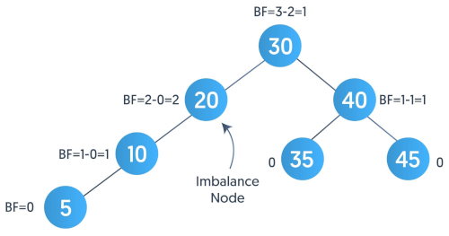
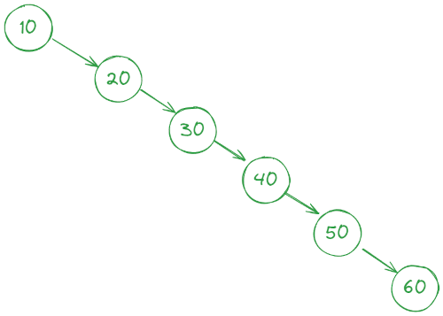

**AVL TREE**
  - It is a **self balancing BST**
  - It has one additional Property when compared with BST
    - Difference between heights of the left and right subtrees cannot be more than 1 for all nodes
  - If above property is not true for any subtree then rebalncing is done (=> rotation)

  - Why AVL tree is used
    - To reduce searching time of an element. 
    - After insertion of element, it is possible that due to the location of the inserted element the performance of tree is impacted
    - Example if we insert 10,20,30,40,50,60, 70 and then if we want to search 60
    It will take 6 iterations to reach node with value 60. If it would have a balanced tree then we would have end up with one iteration to reach node with value 60
       
    
  - Operations
    - Create
      - SAME AS BST
    - Search
      - SAME AS BST
    - Traverse
      - SAME AS BST ( preOrder, inOrder, postOrder, levelOrder)
    - Insert
      - Case 1 : Rotation is not required => After insert Tree is Balanced
      - Case 2 : Rotation is required => After insert Tree is disbalanced => Find the node which is unbalanced, then find the grandchild of that Node.
        - LL => Left Left Condition = > Right Rotation => Rotate the disbalanced node to right.
        - LR => Left Right Condition => Rotate the left child of disbalanced node to left and then rotate the un balanced node to right. 
        - RR => Right Right Condition => Left Rotation => Rotate the disbalanced node to left.
        - RL => Right Left Condition => Rotate the right child of disbalanced node to right and then rotate the unbalanced node to left.
    - Delete a Node
      - Case 1 : rotation is not required
        - a. Leaf Node
        - b. Node has 1 child => Assign the Child (of the Node) to the Parent (of the Node)
        - c. Node has 2 child => Find successor of the Node. => Min Node in the right sub tree => update node's value with minValue Node's value and then Delete the Node with minvalue => Case is Node with one child => Child gets assigned to Parent of Min Node
      - Case 2 : Rotation is required => check if parent of the Node is disbalanced or not.
        - LL
        - LR
        - RR
        - RL
    - Delete Tree

**Complexity**

|                 | Time Complexity | Space Complexity |
|-----------------|-----------------|------------------|
 Create BST       | O(1)            | O(1)             |
 Insert Node   BST  | O(LogN)         | O(LogN)          |
 Traverse BST    | O(N)            | O(N)             |
 Search Node  BST    | O(logN)         | O(logN)          |
  Delet Node BST  | O(LogN)         | O(logN)          | 
 Delete BT       | O(1)            | O(1)             |